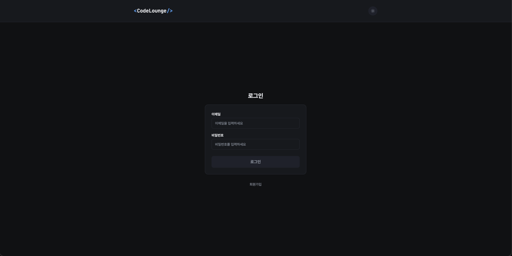
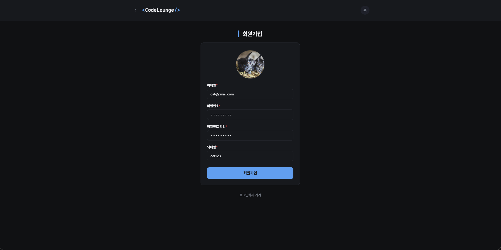
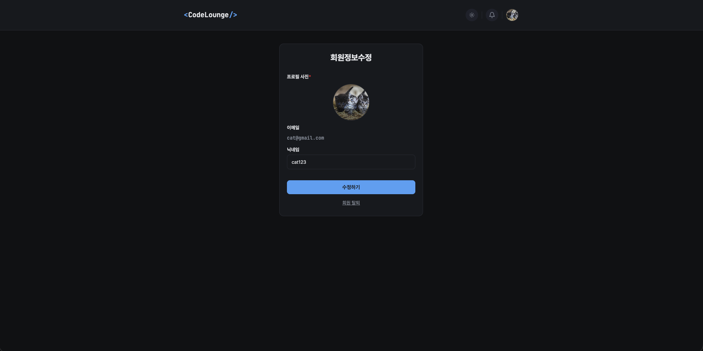
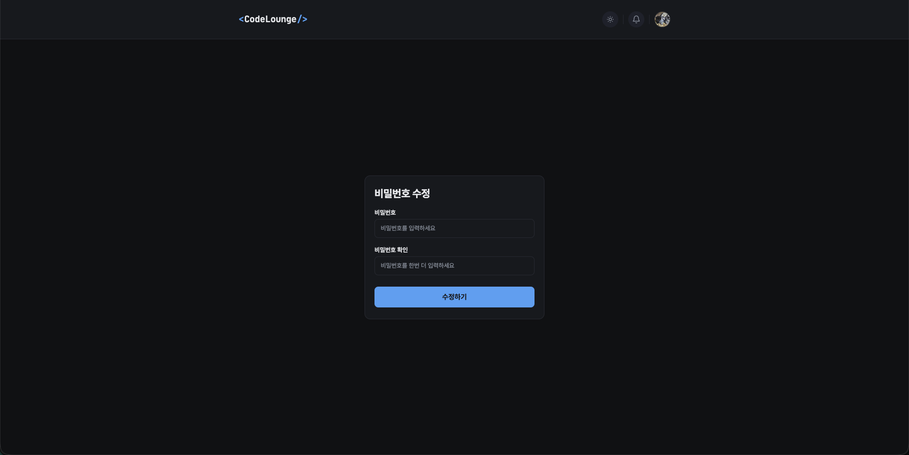
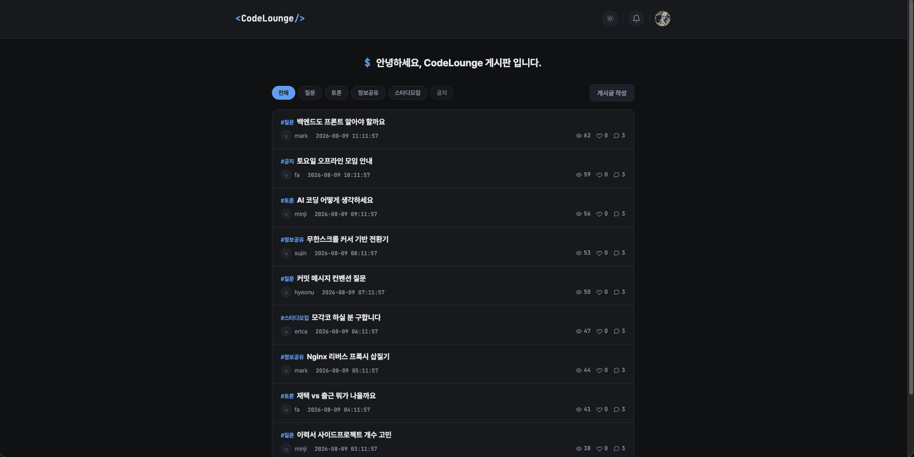
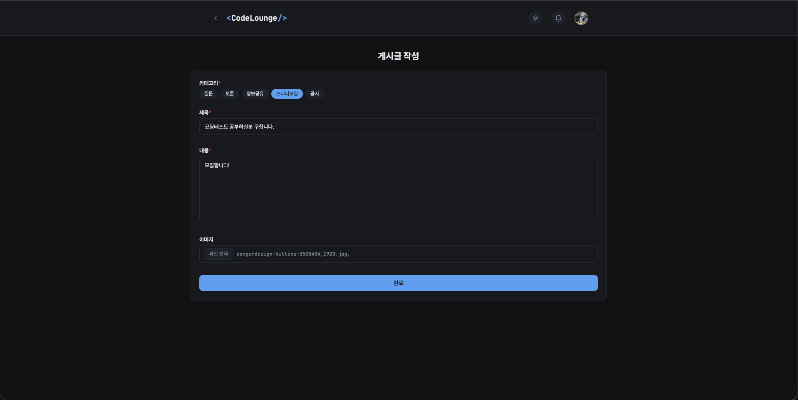
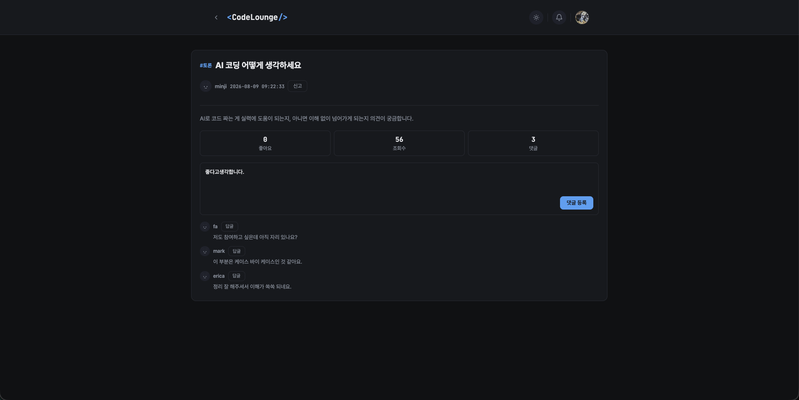
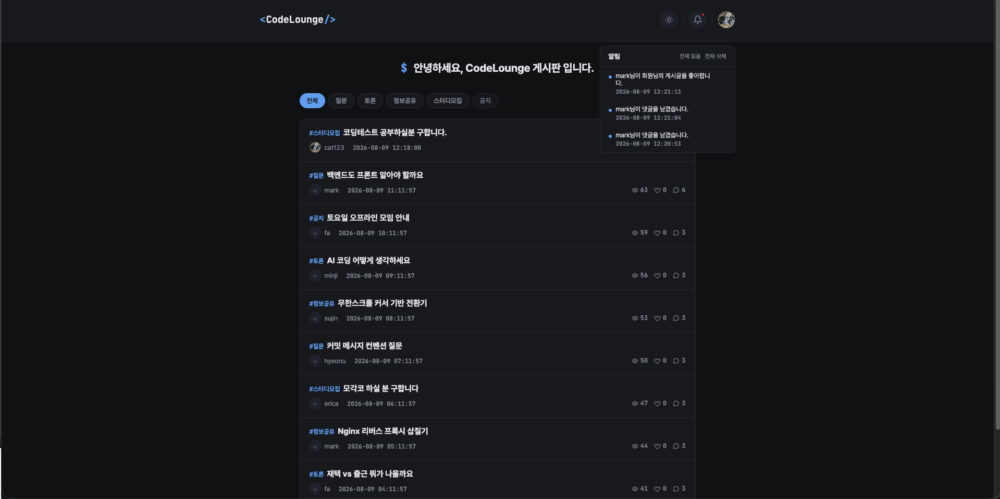
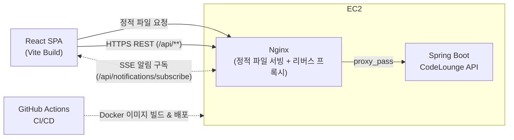

<div align="center">

# CodeLounge

개발 관련 고민과 정보를 나누는 커뮤니티 서비스 프론트엔드입니다<br/>
게시글 · 댓글 · 좋아요 UI와 **SSE 기반 실시간 알림 수신**을 설계하고 구현했습니다.

<p>
  
  
  
  
  
  
</p>

[Back-end 저장소 »](https://github.com/100-hours-a-week/KTB_MARK_FULL_WEEK4)

</div>

## 프로젝트 소개

| 항목 | 내용 |
|---|---|
| 한 줄 소개 | 게시글/댓글/좋아요/실시간 알림 UI를 제공하는 커뮤니티 프론트엔드 |
| 개발 기간 | 2026-07-20 ~ (진행 중, 백엔드 기능에 맞춰 매주 확장) |
| 개발 인원 | 프론트엔드 1명 (본인) |
| 스택 | React 19 + Vite, React Router (SPA) |
| 상태 관리 | 전역 Context(`AuthContext`, `NotificationContext`) + 컴포넌트 로컬 상태, 별도 상태관리 라이브러리 없음 |
| 통신 | 자체 `fetch` 래퍼(`api/client.js`) — 세션 쿠키 + CSRF 헤더 수동 관리 |
| 실시간 처리 | 브라우저 네이티브 `EventSource`로 SSE 알림 구독 |
| 배포 | GitHub Actions CI/CD → Docker(Nginx) → EC2 |

## 화면 구성

<table>
  <tr>
    <td align="center"><br/><b>로그인</b></td>
    <td align="center"><br/><b>회원가입</b></td>
  </tr>
  <tr>
    <td align="center"><br/><b>회원정보 수정</b></td>
    <td align="center"><br/><b>비밀번호 수정</b></td>
  </tr>
  <tr>
    <td align="center"><br/><b>게시글 목록</b></td>
    <td align="center"><br/><b>게시글 작성</b></td>
  </tr>
  <tr>
    <td align="center"><br/><b>댓글 작성</b></td>
    <td align="center"><br/><b>알림 센터</b></td>
  </tr>
</table>

## 아키텍처



- 빌드된 정적 파일(`dist/`)과 API 프록시를 **같은 Nginx가** 함께 처리합니다. `/`로 오는 요청은 정적 파일을, `/api/`로 오는 요청은 백엔드로 넘깁니다.
- Docker 이미지는 멀티스테이지로 빌드됩니다: `node:20-alpine`에서 `npm run build`로 정적 파일을 만들고, 실제 실행 이미지는 `nginx:1.27-alpine` 하나만 담습니다.
- SSE 구독 경로(`/api/notifications/subscribe`)는 별도 Nginx location으로 분리해 `proxy_buffering off`, `proxy_cache off`로 응답을 즉시 흘려보내고, `proxy_set_header Connection ''`로 커넥션이 중간에 끊기지 않게 했습니다.

## 구조

### 페이지 · 기능 매핑

| 페이지 | 경로 | 주요 컴포넌트 / 훅 |
|:---|:---|:---|
| 로그인 | `/`, `/login` | `LoginPage`, `useAuth` |
| 회원가입 | `/signup` | `SignupPage`, `useFieldValidation` |
| 게시글 목록 | `/posts` | `PostListPage`, `PostCard`, `CategoryChips`, `useInfiniteScroll` |
| 게시글 작성 | `/posts/write` | `PostWritePage`, `PostForm`, `useTempPost` |
| 게시글 상세 | `/posts/:postId` | `PostViewPage`, `CommentList`, `CommentForm`, `useComments` |
| 게시글 수정 | `/posts/:postId/edit` | `PostEditPage`, `PostForm` |
| 회원정보 수정 | `/profile/edit` | `ProfileEditPage` |
| 비밀번호 수정 | `/password/edit` | `PasswordEditPage` |

모든 페이지에서 공통으로 쓰는 `Header`가 로그인 상태에 따라 알림 벨(`NotifMenu`)과 프로필 메뉴(`ProfileMenu`)를 노출하고, `Toast`가 최상위에서 실시간 알림 팝업을 띄웁니다.

### 폴더 구조

<details>
  <summary>펼쳐보기</summary>
  <div markdown="1">

      └── src
           ├── main.jsx
           ├── App.jsx                 # 라우트 정의
           ├── index.css               # 전역 스타일 + 컬러 토큰(:root)
           ├── api
           │    ├── client.js          # fetch 래퍼, 세션 쿠키 / CSRF 헤더 처리
           │    ├── auth.js / users.js
           │    ├── posts.js / comments.js
           │    ├── notifications.js
           │    └── files.js / utils.js
           ├── context
           │    ├── AuthContext.jsx        # 로그인 상태 (localStorage 동기화)
           │    └── NotificationContext.jsx # 알림 목록 / 안읽음 수 / 토스트
           ├── hooks
           │    ├── useAuth.js / useFieldValidation.js
           │    ├── useInfiniteScroll.js   # 커서 기반 무한 스크롤
           │    ├── useTempPost.js         # 임시저장 자동저장(30초) + 이어쓰기
           │    ├── useComments.js
           │    ├── useNotifications.js
           │    ├── useNotificationStream.js # EventSource 구독
           │    └── useFileUrl.js
           ├── components
           │    ├── layout
           │    │    ├── Header.jsx / Header.css
           │    │    ├── NotifMenu.jsx
           │    │    └── ProfileMenu.jsx
           │    ├── post
           │    │    ├── PostCard.jsx
           │    │    ├── CategoryChips.jsx
           │    │    └── PostForm.jsx / PostForm.css
           │    ├── comment
           │    │    ├── CommentList.jsx / CommentList.css
           │    │    ├── CommentItem.jsx / CommentItem.css
           │    │    └── CommentForm.jsx / CommentForm.css
           │    └── common
           │         ├── FormField.jsx
           │         ├── DefaultAvatar.jsx   # 프로필 이미지 없을 때의 기본 아바타
           │         ├── ConfirmModal.jsx
           │         └── Toast.jsx           # 실시간 알림 토스트
           └── pages
                ├── LoginPage.jsx / .css
                ├── SignupPage.jsx / .css
                ├── PostListPage.jsx / .css
                ├── PostWritePage.jsx
                ├── PostEditPage.jsx
                ├── PostViewPage.jsx / .css
                ├── ProfileEditPage.jsx / .css
                └── PasswordEditPage.jsx / .css
  </div>
</details>

## 주요 기능

**인증**
- 로그인 시 `/csrf`를 먼저 호출해 CSRF 쿠키를 받아온 뒤, 이후 모든 상태 변경 요청에 `X-XSRF-TOKEN` 헤더를 실어 보냄
- 로그인 정보(`userId`, `userRole`, `profileFileId`)는 `AuthContext` + `localStorage`로 관리해 새로고침해도 로그인 상태 유지
- 이메일 / 비밀번호 형식, 닉네임 공백 여부 등은 `useFieldValidation`으로 필드별 실시간 검증

**게시글**
- 카테고리(질문 / 토론 / 정보공유 / 스터디모집 / 공지) 필터가 걸린 커서 기반 무한 스크롤 목록
- 글쓰기 진입 시 임시글을 자동 생성하고, **30초마다 자동저장**(`useTempPost`) — 브라우저를 닫았다 다시 열면 `localStorage`에 남은 임시글 id를 보고 "이전에 작성 중인 글이 있습니다, 이어서 작성할까요?" 확인 모달을 띄워 이어쓰기(확인) / 새로 쓰기(취소)를 선택하게 함
- 게시글 카드에는 조회수 · 좋아요 · 댓글 수를 아이콘으로 표시, 작성자 프로필 이미지가 없으면 `DefaultAvatar`로 대체

**댓글**
- 댓글 / 대댓글 작성·수정·삭제, 삭제된 댓글은 "삭제된 댓글입니다"로 표시
- 댓글 3개 이상 작성 시 백엔드에서 권한이 `ROLE_AUTH_USER`로 바뀌는데, 이 응답을 받아 `AuthContext`의 역할도 즉시 갱신해 새로고침 없이 글쓰기 버튼이 활성화됨

**알림**
- 브라우저 네이티브 `EventSource`로 `/api/notifications/subscribe`를 구독해 폴링 없이 실시간 수신 (`useNotificationStream`)
- 받은 알림은 `NotificationContext`에 모아 알림 벨 목록과 화면 우측 하단 Toast(4초 후 자동 소멸)에 함께 반영, Toast 클릭 시 읽음 처리 후 해당 게시글로 이동
- 재연결/유실 복구는 `EventSource`가 자동으로 보내는 `Last-Event-ID`와 백엔드 처리에 맡기고, 프론트는 별도 재시도 로직 없이 이벤트만 받으면 됨

## 로컬 실행

```bash
npm install
npm run dev        # http://localhost:5173, 백엔드는 localhost:8080 필요

npm run build       # 프로덕션 빌드 (dist/)
npm run preview     # 빌드 결과 미리보기
```

Docker로 백엔드까지 함께 띄우려면 백엔드 저장소의 `deploy/docker-compose.yml`을 사용합니다 (`context: ../../assignment_10`로 이 저장소를 참조).

## 프로젝트 후기
바닐라 자바스크립트 프로젝트를 AI로 리액트 마이그레이션 및 기능개발을 한 프로젝트입니다. 이때 리액트에 대한 이해를 먼저 가져간 후에 마이그레이션을 진행하기 위해 리액트 공식문서를 기반으로 학습한 뒤 문서를 만들었습니다. AI를 활용해서 개발한 프로젝트인만큼 마이그레이션 이후에 이해하기 위한 시간을 따로 들였고 그 이후에 알림 기능을 추가를 위해 프론트엔드에서 사용할 API 문서를 만들고 기능개발을 진행했습니다. 이때 설계시에 어떤 응답 및 구조를 가지면 좋을지 고민하고 개발을 진행했습니다.

